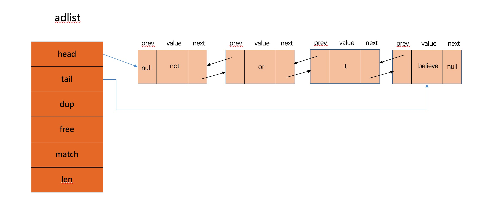

## 双端链表

### 结构

​		Redis中的链表叫`adlist`（A generic doubly linked list implementation 一个通用的双端链表实现,无环），下面看下它的数据结构实现

```c
typedef struct listNode {
    struct listNode *prev;
    struct listNode *next;
    void *value;
} listNode;

typedef struct listIter {
    listNode *next;
    int direction;
} listIter;

typedef struct list {
    listNode *head;
    listNode *tail;
    void *(*dup)(void *ptr);
    void (*free)(void *ptr);
    int (*match)(void *ptr, void *key);
    unsigned long len;
} list;
```

结构图




### 功能实现

- 链表的创建，释放，节点的插入，头部添加，尾部添加，节点的删除

- 链表的迭代器实现，遍历， 反向等

  

  由于以上功能比较简单，这里不再细写实现。

  


### 应用场景

双端列表被广泛应用于实现redis的各种功能，比如列表对象，发布订阅，慢查询，监视器等。


