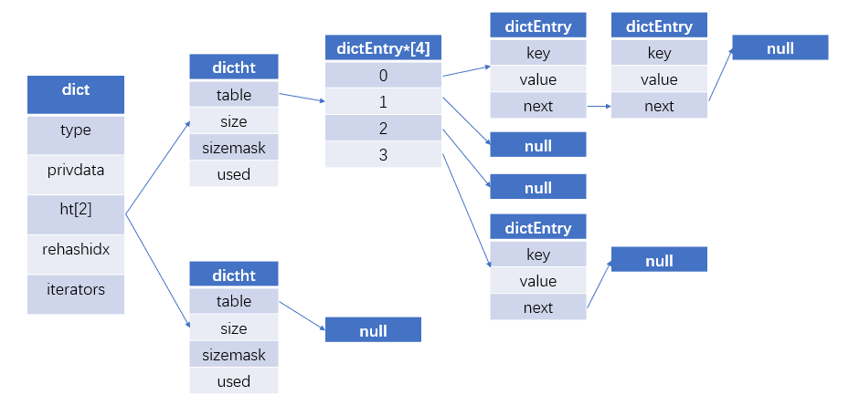

redis底层数据结构主要有：dict，skiplist，sds, list, intset, ziplist, zipmap 

##   

## **字典** 

​    	字典在redis中的应用非常的广泛，redis的数据库存储就是使用字典作为底层实现的，对于数据库的增，删，改，查都在构建在对字典的操作上。同时字典也是hash对象的底层实现之一。


#### 结构图



#### 哈希算法

​		当将一个新的键值对存入字典的时候，程序就会根据key计算出hash值和索引值，然后根据索引值将键值对放在数组对应的位置上。

  计算hash值和索引值的方式：

  hash = dict->type->hashFunction(key);

  index = hash & dict->ht[x].sizemask;

  

  当字典被当作数据库与hash对象的底层实现的时候，采用MurmurHash2算法计算hash值。

​		MurmurHash 是一种非加密型哈希函数，适用于一般的哈希检索操作。 由Austin Appleby在2008年发明， 并出现了多个变种，都已经发布到了公有领域(public domain)。与其它流行的哈希函数相比，对于规律性较强的key，MurmurHash的随机分布特征表现更良好。

 

#### hash冲突

​	由于hash函数的定义域远大于值域，不同的输入可能会得到相同的hash值，此时就会出现冲突。

​	redis dict使用拉链法来解决冲突，同时为了速度考虑，在添加新节点的时候，都会将新节点添加到链表的头部。

 

#### rehash

​		由于哈希表保存的键值对会逐渐的增加或者减少，为了让哈希表的负载因子（load_factor）维持在一个合理的范围之内，就需要对哈希表进行相应的扩张和收缩。

  	load_factor = ht[0].used / ht[0].size

rehash步骤如下

1. 为ht[1]分配空间，
   1. 当执行扩张操作的时候，ht[1].size 就等于第一个大于等于ht[0]->user*2的2n 。
   2. 当执行收缩操作的时候，ht[1].size 就等于第一个大于等于ht[0]->user的2n。
2. 将ht[0]中的所有键值对重新计算hash值和索引，放入到ht[1]中（渐进式的）。
3. 当ht[0]中的所有键值对迁移完毕，释放ht[0]指向的哈希表，并且指向ht[1]指向的哈希表，然后将ht[1]的哈希表设置为null。

  

rehash时机

1. 收缩时机：load_factor<0.1
2. 扩张时机：在没有执行BGSAVE与BGREWRITEAOF的情况下，load_factor >= 1。 否则load_factor>=5。（注：在这两个命令下，系统会创建子进程，绝大多数的系统会采用写时复制（copy-on-write）技术来优化子进程使用效率，提高负载因子，可以避免不必要的内存写入操作。）

 

 

#### 渐进式rehash

  为了避免数据量庞大的时候进行rehash，对redis服务器性能造成影响，系统不会一次性的将ht[0]中的数据迁移到ht[1]中，而是在对dict进行增删改查操作的时候，会对ht[0]哈希表中的一条链表上的数据进行迁移（前提是iterators==0）。

  在rehash期间，对dict的删，改，查操作会在ht[0]与ht[1]上进行操作，增操作只会在ht[1]上进行。


#### 迭代器

redis迭代器有两种，安全迭代器与非安全迭代器。结构如下

```c
typedef struct dictIterator {
    dict *d;
    long index;
    int table, safe;  // safe = 1是安全迭代器，safe = 0 非安全迭代器
    dictEntry *entry, *nextEntry;
    /* unsafe iterator fingerprint for misuse detection. */
    long long fingerprint;
} dictIterator;
```

安全迭代器与非安全迭代器的区别：

​		安全迭代器在开始迭代的过程中，会让`dict`结构中的`iterators`字段自增1，每次进行字典的CURD操作且需要rehash的时候，如果iterators不等于0，就不进行rehash。

​		非安全迭代器在迭代的过程中，是不允许对字典进行修改的。

那么为什么不都使用安全迭代器呢？我们观察代码发现在进行持久化的时候会使用非安全迭代器。原因如下：

* *安全/非安全迭代器的目的是清楚地确定迭代是发生在可变的还是不可变的数据结构上。在dict实现中，当安全迭代正在进行时，它会阻止在字典上执行某些操作（例如重新刷新）。*
  *现在安全迭代器有一个缺点：它们需要在迭代器对象本身中增加一个引用计数器，以便对象知道是否发生了安全迭代器。*
  *Redis利用OS copy-on-write（COW，COW是按照页进行复制的）机制处理后台转储。当发生转储时，将调用fork来克隆redis实例并创建第二个进程。此过程将对整个数据进行迭代，以将所有内容序列化到转储文件中。由于CoW机制，大多数页面在这两个进程之间共享，因此Redis在转储数据时不会占用两倍的RAM。*
  *现在，只有在以只读模式访问页面时才共享这些页面。当两个进程中的一个在内存中写入某些内容时，操作系统会自动复制相应的页面。*
  *如果安全迭代器被系统地用于对所有字典进行迭代器，那么将复制大量页面（因为引用计数器更新）。在克隆过程中，数据被认为是不可变的，因此使用不安全的迭代器可以减少COW活动。当redis中有很多set/hash/zset对象时，这一点最为相关。*