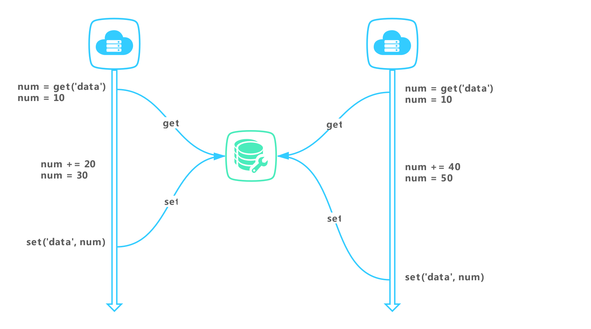

## Redis实现分布式锁

### 引言

​		我们在系统中修改已有数据时，需要先读取，然后进行修改保存，此时很容易遇到并发问题。由于修改和保存不是原子操作，在并发场景下，部分对数据的操作可能会丢失。在单服务器系统我们常用本地锁来避免并发带来的问题，然而，当服务采用集群方式部署时，本地锁无法在多个服务器之间生效，这时候保证数据的一致性就需要分布式锁来实现。

**一、一个可靠的、高可用的分布式锁需要满足以下几点**

- **互斥性：**任意时刻只能有一个客户端拥有锁，不能被多个客户端获取
- **安全性：**锁只能被持有该锁的客户端删除，不能被其它客户端删除
- **死锁：**获取锁的客户端因为某些原因而宕机，而未能释放锁，其它客户端也就无法获取该锁，需要有机制来避免该类问题的发生
- **高可用：**当部分节点宕机，客户端仍能获取锁或者释放锁

**二、利用单节点Redis实现分布式锁**

Redis 锁主要利用 Redis 的 setnx 命令。

- 加锁命令：SETNX key value，当键不存在时，对键进行设置操作并返回成功，否则返回失败。KEY 是锁的唯一标识，一般按业务来决定命名。
- 解锁命令：DEL key，通过删除键值对释放锁，以便其他线程可以通过 SETNX 命令来获取锁。

缺点：获取锁的客户端因为某些原因而宕机，而未能释放锁，其它客户端也就无法获取该锁，需要有机制来避免该类问题的发生。

​		为解决上述问题，使用EXPIRE key timeout命令, 设置 key 的超时时间，以保证即使锁没有被显式释放，锁也可以在一定时间后自动释放，避免资源被永远锁住。

setnx+expire的方式仍然存在问题，由于setnx与expire是非原子性操作，如果 SETNX 成功，在设置锁超时时间后，服务器挂掉、重启或网络问题等，导致 EXPIRE 命令没有执行，锁没有设置超时时间变成死锁。

解决上述问题方案：

- 使用Lua脚本来保证原子性。redis开源社区有很多分布式锁的library，专门来解决这个问题。
- 在redis 2.8版本中，对set指令进行了拓展，使得setnx与expire指令可以一起执行，解决了上述原子性问题。

**三、锁的误删除**

​		如果线程 A 成功获取到了锁，并且设置了过期时间 30 秒，但线程 A 执行时间超过了 30 秒，锁过期自动释放，此时线程 B 获取到了锁；随后 A 执行完成，线程 A 使用 DEL 命令来释放锁，但此时线程 B 加的锁还没有执行完成，线程 A 实际释放的线程 B 加的锁。

​		为避免这个问题，Redis分布式锁尽量不要用与较长时间的任务。还有就是将set指令的value参数设置为一个随机数，释放锁的时候先判断是否一致，然后再删除key，以确保当前线程占有的锁不会被其他线程释放，除非因为锁过期被服务器自动释放（匹配value与删除key不是原子性的，需要使用lua脚本进行实现删除）。

**四、锁超时**

​		如果线程 A 成功获取锁并设置过期时间 30 秒，但线程 A 执行时间超过了 30 秒，锁过期自动释放，此时线程 B 获取到了锁，线程 A 和线程 B 并发执行。

解决方式

- 将过期时间设置足够长，确保代码逻辑在锁释放之前能够执行完成。
- 为获取锁的线程增加守护线程，为将要过期但未释放的锁增加有效时间。

**五、可重入性**

​		可重入性是指线程在持有锁的情况下再次请求加锁，如果一个锁支持同一个线程的多次加锁，那么这个锁就是可重入的。Redis 可通过对锁进行重入计数，加锁时加 1，解锁时减 1，当计数归 0 时释放锁。具体实现可Google。

**六、集群**

​		单节点Redis分布式锁最大的缺点就是它加锁时只作用在一个Redis节点上，即使Redis通过sentinel保证高可用，如果这个master节点由于某些原因发生了主从切换，那么就会出现锁丢失的情况：

1. 在Redis的master节点上拿到了锁；
2. 但是这个加锁的key还没有同步到slave节点；
3. master故障，发生故障转移，slave节点升级为master节点；
4. 导致锁丢失。

正因为如此，Redis作者antirez基于分布式环境下提出了一种更高级的分布式锁的实现方式：**Redlock**。

##### Redlock的思想

​		在Redis的分布式环境中，我们假设有N个Redis master。这些节点**完全互相独立，不存在主从复制或者其他集群协调机制**。我们确保将在N个实例上使用与在Redis单实例下相同方法获取和释放锁。现在我们假设有5个Redis master节点，同时我们需要在5台服务器上面运行这些Redis实例，这样保证他们不会同时都宕掉。

为了取到锁，客户端应该执行以下操作:

- 获取当前Unix时间，以毫秒为单位。
- 依次尝试从5个实例，使用相同的key和**具有唯一性的value**（例如UUID）获取锁。当向Redis请求获取锁时，客户端应该设置一个网络连接和响应超时时间，这个超时时间应该小于锁的失效时间。例如你的锁自动失效时间为10秒，则超时时间应该在5-50毫秒之间。这样可以避免服务器端Redis已经挂掉的情况下，客户端还在死死地等待响应结果。如果服务器端没有在规定时间内响应，客户端应该尽快尝试去另外一个Redis实例请求获取锁。
- 客户端使用当前时间减去开始获取锁时间（步骤1记录的时间）就得到获取锁使用的时间。**当且仅当从大多数**（N/2+1，这里是3个节点）**的Redis节点都取到锁，并且使用的时间小于锁失效时间时，锁才算获取成功**。
- 如果取到了锁，key的真正有效时间等于有效时间减去获取锁所使用的时间（步骤3计算的结果）。
- 如果因为某些原因，获取锁失败（没有在至少N/2+1个Redis实例取到锁或者取锁时间已经超过了有效时间），客户端应该在**所有的Redis实例上进行解锁**（即便某些Redis实例根本就没有加锁成功，防止某些节点获取到锁但是客户端没有得到响应而导致接下来的一段时间不能被重新获取锁）。