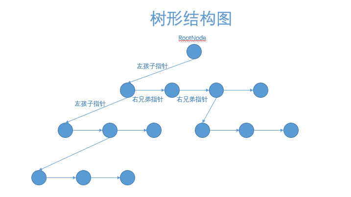

# 多级菜单

**主要的类：**

1. MultiLevelMenuComponent     
2. MultiLevelMenuCell     
3. MultiLevelMenuTree
4. MultiLevelMenuNode

前两个是显示UI,后两个是数据。UI通过监听所绑定的数据的事件进行显示刷新。

 

**用法：**

   要显示出多级菜单，需要创建出一个菜单树结构,并且获取根节点，构建树结构的节点

   local menuTree = MultiLevelMenuTree.New();

   local root = menuTree:GetRoot();

   树节点的创建可以通过两个方式

   推荐：通过该树创建

   local menuNode = menuTree:CreateNode(skin, width, height, leftOffset, isOpen, userData);

   不推荐：直接构建节点，然后进行初始化，注意创建实例的时候需要传递所属的树

   local menuNode = MultiLevelMenuNode.New(menuTree);

   menuNode:InitNode(skin, width, height, leftOffset, isOpen, userData);

   然后添加节点

   root:AddChild(menuNode); --一级菜单

   MenuNode:AddChild(menuTree:CreateNode(skin, width, height, leftOffset, isOpen, userData)); --二级菜单

   ----- ....可添加多级菜单

   创建完树结构，然后将树结构绑定到显示的UI上

   local menuUI = MultiLevelMenuComponent.New(self.widgets.widget);

   menuUI:SetMenuTree(menuTree);

   绑定后，所有的操作都可以在menuTree上，或者其节点menuNode上进行操作。UI显示会自动刷新。

**注意：**

   先将树构建好再与显示UI进行绑定。

   显示UI MultiLevelMenuComponent 只负责显示，一些selected，click，open，close等操作全在menuTree的节点menuNode上操作完成。操作完成 与之menuTree绑定的MenuUI会自动刷新。

   外部监听的事件也是监听menuTree的事件。

   选中节点，每棵树只能选中一个节点，选中节点的存储，内部已经维护，外部不需要存，只需要Set Get 就可设置和获取选中节点。

 

**MultiLevelMenuTree****类**

  描述：

​     存储菜单的树形结构，进行树形结构变化的事件的广播。

  主要方法：

​     CreateNode 创建该树节点。

​     GetRoot    获取树的根节点   

​     GetSelectedNode 获取选中的节点 

​     SetSelectedNode 设置选中的节点

​     --下面是一些委托

​    OnMenuNodeDataChangeDelegate

​    OnClickDelegate

​    OnSelectedDelegate

​    OnSelectedChildDelegate

​    OnMenuNodeOpenDelegate

​    OnMenuNodeCloseDelegate

 

**MultiLevelMenuNode****类**

描述：

  树节点，采用左孩子右兄弟表示法，这样每个节点只需要维护两个指针，不需要维护所有孩子的表，比较节省空间，并且进行前序遍历也比较方便。

  有一些操作 Click, Selected, Open, Close, SetData。也是常用的方法，进行这些操作会自动广播事件，广播参数为自身。

 

**MultiLevelMenuComponent****类**

描述：

  主要用来进行树的显示的，该类实例只需要绑定一个menuTree的实例就可以，不需要进行其他操作，该怎么显示是这个类根据menuTree的每个节点的属性进行操作的。

同时会监听menuTree变化的事件，对ui显示进行具体的刷新。

  该类，可通过SetMenuTree方法和不同的树进行绑定，同时可以通过GetMenuTree方法获取绑定的树结构。

  可以通过GetMenuCell方法获取menuNode对应的menuCell，可能是nil；

  树形结构到显示列表结构的转化，主要使用**MultiLevelMenuComponent****类** 里面的 _ConvertTreeToShowList 方法。

 

**MultiLevelMenuCell****类**

描述:

   节点对应的ui，不是每个menuNode都有对应的menuCell，只有处于显示区域的menuNode有对应的menuCell,可以通过**MultiLevelMenuComponent**中的GetMenuCell方法获取menuNode对应的menuCell，可能是nil

 

 

 

 

 

 

 

 

 