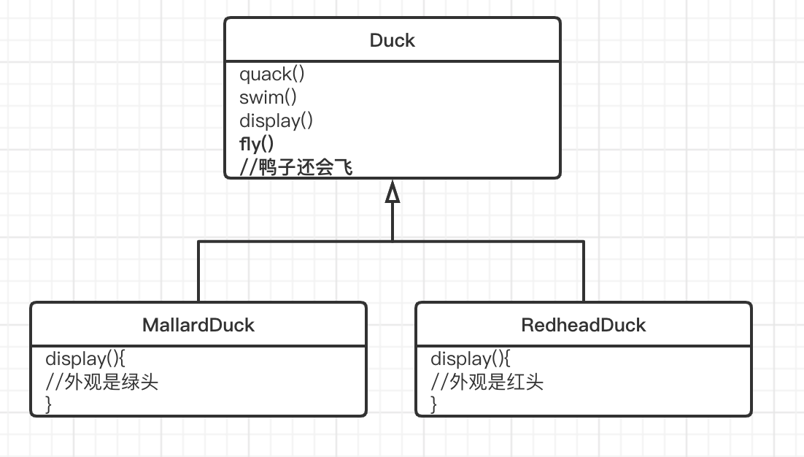
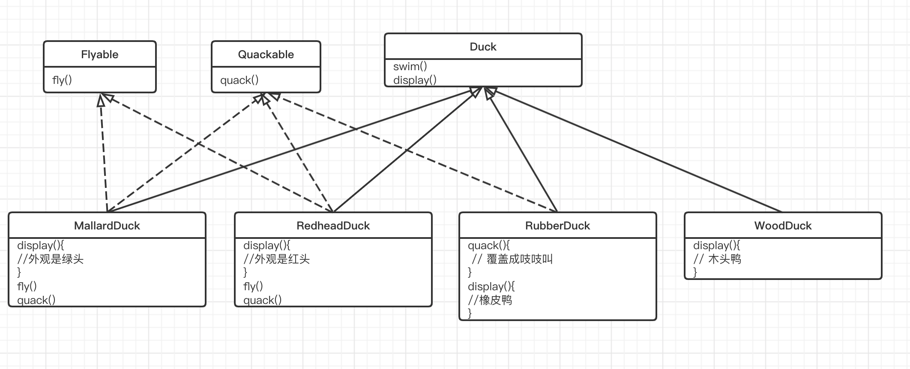
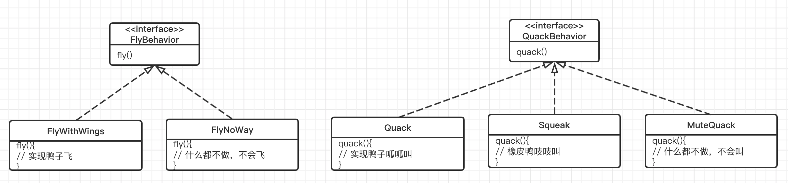
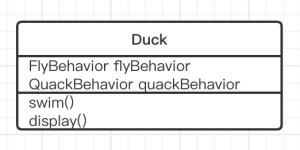

## 策略模式

### 软件开发的一个不变真理 - CHANGE

​		不管当初软件设计的多好，架构多完美，一段时间之后，总是需要成长和改变。否者软件就会“死亡”，即使是“hello world”有时也需要维护他

### 软件开发完成前以及完成后，哪个花费更多的时间呢？

​		我们总是需要花许多时间在系统的维护和变化上，比原先开发花的时间更多

**所以我们应该致力于提高可维护性和可扩展性上的复用程度！**

上述原因，所以想一起回顾下模式，提高代码复用和稳定性

## 又双叒叕是鸭子

所有鸭子都会呱呱叫，会游泳，所以超类来负责实现

新需求：会飞的鸭子

漏掉了鸭子都会飞，增加fly()方法，所有子类都会继承

新需求：增加橡皮鸭，增加木头鸭

因为橡皮鸭是吱吱叫，所以要覆盖quack()方法，也不会飞，fly()也没用。木头鸭只有display()有用。

所以利用继承的缺点是：

- 代码在多个子类中重复，可能玩具鸭也是吱吱叫，没法复用橡皮鸭的quack()
- 很难知道所有鸭子的全部行为，加一个鸭子就要在实例类中增加一个新行为
- 运行时的行为不容易改变
- 改变会牵一发动全身，比如更改基类的quack()方法，

新需求：N多新鸭子

并不是所有鸭子都会飞和叫，继承不是适当的解决办法

那么我们可以把fly()从基类中取出来，放进一个flyable接口中，这样一来，只有会飞的鸭子才需要实现这个接口。因为不是所有的鸭子都会飞和叫

问题又来了

- 没有解决代码复用问题
- 如果要修改相同行为鸭子的飞行行为，就需要修改N个地方

设计原则

找出应用中可能需要变化之处，把他们独立出来，不要和那些不需要变化的代码混在一起（***所有设计模式最核心的思想了\***）

***把会变化的部分取出“封装”起来，好在需求来的时候，做修改不影响其他部分，系统变得更有弹性***

其实在实际业务中，想把变化的抽象出来，你会发现并不简单

优惠券如何抽象，变化的是什么，不变的是什么呢？ 

我们知道Duck类内的fly()和quack()会随着鸭子不同而不同，所以分离出来，建立一组新类代表不同行为，方便复用

设计原则

针对接口编程，而不是针对实现编程。

（就是SOLID原则中的依赖倒置，比如应该定义数据库、消息队列接口来使用，而不是裸着调用，保不齐换数据库）

***这样的设计，可以让飞行和呱呱叫的动作被其他的对象复用，为这些行为已经和鸭子类无关了***

***而且可以新增一些行为，不会影响到既有的行为类，也不会影响“使用”到飞行行为的鸭子类***

新的类

**策略模式** - 定义了算法族，分别封装起来，让它们之间可以互相替换，此模式让算法的变化独立于使用算法的客户

参考 《Head First 设计模式》